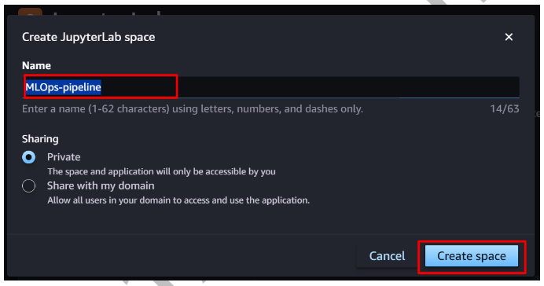
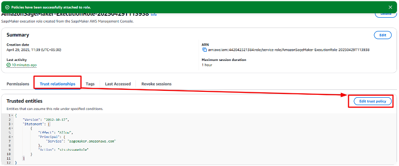
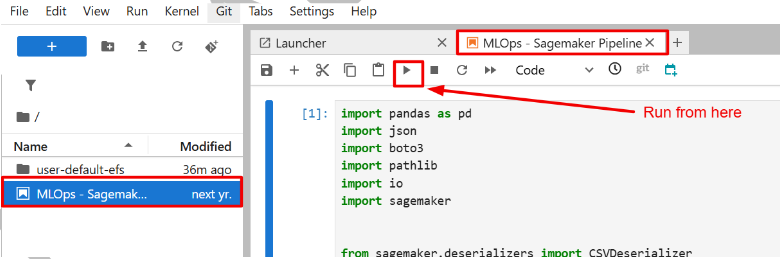

# 🧠 MLOps Pipeline for Fraud Detection using Amazon SageMaker

An end-to-end, fully automated MLOps pipeline for detecting fraudulent insurance claims using Amazon SageMaker. The pipeline covers the complete ML lifecycle — data preprocessing, model training, bias detection, explainability, conditional deployment, and model governance — using managed AWS services.

> **Scenario:** As an AIML Engineer at MindSpace, the goal was to build a scalable fraud detection system for a financial services client that automatically flags fraudulent transactions in real-time.

---

## 🚀 Tech Stack

| Category | Tools |
|----------|-------|
| Cloud Platform | Amazon SageMaker, AWS Lambda, Amazon S3 |
| ML Framework | XGBoost (binary classification) |
| Pipeline | SageMaker Pipelines |
| Fairness & Explainability | SageMaker Clarify (SHAP values, bias detection) |
| Model Governance | SageMaker Model Registry |
| Deployment | AWS Lambda, SageMaker Real-Time Endpoint |
| Monitoring | CloudWatch |
| IAM & Security | AWS IAM Roles & Policies |
| Language | Python, Jupyter Notebook |

---

## 🏗️ Pipeline Architecture

```
Raw Data (S3)
     ↓
[Step 1] Data Processing (SKLearnProcessor)
     ↓ → Train (80%) / Validation (10%) / Test (10%)
[Step 2] XGBoost Model Training
     ↓
[Step 3] Model Evaluation (ROC-AUC score)
     ↓
[Step 4] Condition Check → IF AUC ≥ 0.7 → Continue | ELSE → Stop
     ↓
[Step 5] Bias Detection (SageMaker Clarify - Gender Bias)
     ↓
[Step 6] Explainability Check (SHAP Values)
     ↓
[Step 7] Model Registration (SageMaker Model Registry)
     ↓
[Step 8] Real-Time Endpoint Deployment (via AWS Lambda)
```

---

## 🔄 Pipeline Steps (Detailed)

### 1️⃣ Data Processing
- Merged two datasets: `claims.csv` + `customers.csv` (joined on `policy_id`)
- Handled missing values, one-hot encoded categorical features
- Ordinal encoded: `police_report_available`, `policy_liability`, `customer_education`
- Split data: **80% train / 10% validation / 10% test**
- Uploaded processed splits to Amazon S3

### 2️⃣ Model Training
- Algorithm: **XGBoost** (binary:logistic)
- Evaluation metric: **ROC-AUC**
- Key hyperparameters:
  - `max_depth`: 5
  - `eta`: 0.5
  - `subsample`: 0.75
  - `colsample_bytree`: 0.75
  - `num_round`: 5
- Used cross-validation during training
- Instance: `ml.m4.xlarge`

### 3️⃣ Model Evaluation
- Evaluated on held-out **test set**
- Metric: **ROC-AUC score**
- Results saved to `evaluation.json` in S3

### 4️⃣ Conditional Deployment
- Pipeline automatically checks: **IF ROC-AUC ≥ 0.7 → Deploy**
- If below threshold → pipeline stops, model not deployed
- Ensures only high-quality models reach production

### 5️⃣ Bias Detection (SageMaker Clarify)
- Checked for **gender bias** in predictions (`customer_gender_female`)
- Method: **DPPL** (Difference in Positive Proportions of Labels)
- Ensures fairness and ethical AI compliance

### 6️⃣ Explainability (SHAP Values)
- Used **SHAP** to explain individual predictions
- Generated global and local feature importance scores
- Helps stakeholders understand WHY the model made a decision

### 7️⃣ Model Registry
- Registered model with:
  - Bias metrics
  - Explainability metrics
  - Drift check baselines
- Enables version control and model governance

### 8️⃣ Real-Time Endpoint Deployment
- **AWS Lambda** function (`lambda_deployer.py`) handles:
  - Creating SageMaker model
  - Creating endpoint configuration
  - Deploying real-time inference endpoint
- Instance: `ml.m4.xlarge`
- Endpoint returns **fraud probability** for each transaction

---

## 📊 Model Details

**Dataset:** Synthetic automobile insurance claims  
**Source:** AWS SageMaker Sample Files (`sagemaker-sample-files`)  
**Task:** Binary Classification → `fraud = 1` (fraudulent) / `fraud = 0` (legitimate)

**Key Features:**
- Transaction/claim details
- Customer demographics
- Policy information
- Historical patterns

**Evaluation Metric:** ROC-AUC  
**Deployment Threshold:** AUC ≥ 0.7 (automated conditional check)

> ⚠️ Fraud detection problems prioritize **Recall** over Accuracy — missing a fraudulent claim (false negative) is more costly than a false alarm.

---

## 📁 Repository Structure

```
mlops-fraud-detection-sagemaker/
│
├── notebooks/
│   └── MLOps-Sagemaker-Pipeline.ipynb    # Main pipeline notebook
│
├── scripts/
│   ├── preprocessing.py                   # Data preprocessing script
│   ├── xgboost_train.py                   # XGBoost training script
│   ├── evaluate.py                        # Model evaluation script
│   └── lambda_deployer.py                 # Lambda deployment function
│
├── images/                                # Screenshots & architecture diagrams
│   ├── jupyterlab-space.png
│   ├── iam-role-config.png
│   └── notebook-execution.png
│
└── README.md
```

---

## 📸 Project Setup Screenshots

### 1️⃣ JupyterLab Space Creation
Created a dedicated SageMaker JupyterLab space named `MLOps-pipeline` to run the pipeline.



### 2️⃣ IAM Role Configuration
Attached required policies to `AmazonSageMaker-ExecutionRole`:
- `AmazonS3FullAccess`
- `AWSLambda_FullAccess`
- `CloudWatchFullAccess`

Updated trust policy to allow both `sagemaker.amazonaws.com` and `lambda.amazonaws.com`.



### 3️⃣ Notebook Execution in SageMaker Studio
Pipeline notebook running inside SageMaker Studio with all imports loaded.



---

## ⚙️ How to Run This Project

### Prerequisites
- AWS Account (Free Tier works)
- SageMaker Studio domain set up
- IAM role with S3, Lambda, CloudWatch permissions

### Steps

**1. Set up SageMaker Studio**
```
AWS Console → SageMaker → Domains → Create Domain (Quick Setup)
```

**2. Configure IAM Role**
```
IAM → Roles → AmazonSageMaker-ExecutionRole → Attach Policies:
- AmazonS3FullAccess
- AWSLambda_FullAccess  
- CloudWatchFullAccess
```

**3. Update Trust Policy**
```json
{
  "Version": "2012-10-17",
  "Statement": [{
    "Effect": "Allow",
    "Principal": {
      "Service": ["lambda.amazonaws.com", "sagemaker.amazonaws.com"]
    },
    "Action": "sts:AssumeRole"
  }]
}
```

**4. Upload and Run Notebook**
```
SageMaker Studio → JupyterLab → Upload MLOps-Sagemaker-Pipeline.ipynb → Run All Cells
```

**5. Monitor Pipeline**
```
SageMaker → Pipelines → FraudDetectXGBPipeline → View Execution
```

---

## 💰 Cost Awareness

| Service | Free Tier | Beyond Free Tier |
|---------|-----------|-----------------|
| SageMaker | 250 hrs/month (ml.t2.medium) | ~$0.05/hr |
| Amazon S3 | 5 GB storage | ~$0.023/GB/month |
| AWS Lambda | 1M requests/month | $0.20/1M requests |
| API Gateway | 1M calls/month | $3.50/1M requests |

**✅ Cost Cleanup Completed:**
- Endpoint deleted after testing
- Lambda function deleted
- Notebook instances stopped
- SageMaker domain deleted
- Only S3 storage retained

---

## 🎯 Key Learning Outcomes

✅ Built a **fully automated ML pipeline** using SageMaker Pipelines  
✅ Implemented **conditional deployment** (model only deploys if AUC ≥ 0.7)  
✅ Used **SageMaker Clarify** for bias detection and SHAP explainability  
✅ Applied **AWS Lambda** for serverless model deployment  
✅ Implemented **Model Registry** for versioning and governance  
✅ Hands-on experience with **IAM roles, S3, CloudWatch**  
✅ Understanding of **MLOps best practices** in production environments  

---

## 🔮 Future Improvements

- [ ] Add **Model Drift Monitoring** using SageMaker Model Monitor
- [ ] Implement **CI/CD pipeline** using GitHub Actions + CodePipeline
- [ ] Add **SageMaker Model Registry** approval workflow
- [ ] Set up **automated retraining** when drift is detected
- [ ] Add **API Gateway** for external access to the endpoint
- [ ] Implement **A/B testing** between model versions

---

## 👩‍💻 Author

**Kritika Aggarwal**  
AI/ML Engineer  
📧 kritikaaggarwal2227@gmail.com  
🔗 [LinkedIn](https://linkedin.com/in/kritika-aggarwal-734997249/)  
💻 [GitHub](https://github.com/KritikaK21)

---

> ⭐ **Note:** All code is executed inside Amazon SageMaker Studio — not locally. The notebook uploads scripts to S3 which are then used by SageMaker processing and training jobs.
